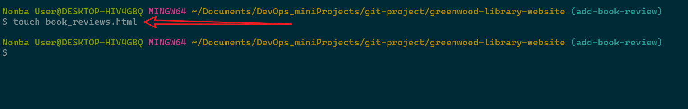

# greenwood-library-website

 This is a simple simulation of a library website. It is built using HTML, CSS. 

 It shows two developer's Morgan and Jaime's work. 

 Both created a branch of the main repo and work on different features

## Task One: 
1. Creating the main repository

2. Cloning the repository to local machine

3. Added the html files and css files to the local repo

4. Confirmed the changes and pushed to the main branch

## Task Two:
1. Created a new branch for Morgan with name add-book-review using the command `git checkout -b add-book-review`

2. Added the book review html and css files to the local repo

3. Structured the book review page using HTML

4. Staged, commit and pushed the changes to the add-book-review branch using the command `git push origin add-book-review`

5. Check the presence of the new branch on github

6. Created a pull request to merge the changes from add-book-review branch to the main branch

7. Merged the pull request to the main branch

## Task Three:
1. Created a new branch for Jaime with name update-events using the command `git checkout -b update-events`

2. Added the events html and css files to the local repo

3. Staged, commit and pushed the changes to the update-events branch using the command `git push origin update-events`

4. Created a pull request to merge the changes from update-events branch to the main branch

5. Pull update in the main to local repo using the command `git pull origin main`
5a. Merged the changes from main branch to update-events branch using the command `git merge update-events`
5b. Resolved the merge conflicts in the events.html file

6. Merged the pull request to the main branch

